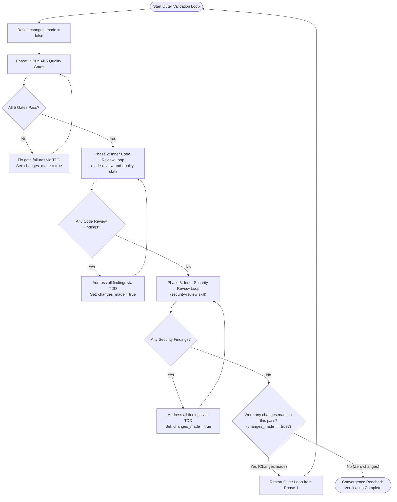

# Verification and Test Suite Validation Rules

These rules govern mandatory verification, test suite execution, code reviews, and quality gates that every agent **MUST** satisfy before considering any task, feature, bug fix, or refactoring complete.

## 1. The Verification & Validation Meta-Loop Architecture

Validation is structured as an **Outer Convergence Loop** enclosing the 5 Quality Gates and **Two Inner Loops** (Code Review and Security Review).

An agent is only permitted to break out of the Outer Loop when an entire pass completes with **zero changes made** across all phases.



### The Convergence Protocol:
1. **Initialize Outer Iteration**: Track whether any files are modified during this outer loop pass (`changes_made = false`).
2. **Phase 1: Quality Gates Execution**: Run the 5 zero-tolerance quality gates. If code or tests must be updated to pass, mark `changes_made = true`.
3. **Phase 2: Inner Code Review Loop**: Invoke the `code-review-and-quality` skill. If findings exist, resolve them completely, mark `changes_made = true`, and re-review until zero findings remain.
4. **Phase 3: Inner Security Review Loop**: Invoke the `security-review` skill. If security findings exist, resolve them completely, mark `changes_made = true`, and re-scan until zero findings remain.
5. **Phase 4: Outer Loop Convergence Decision**:
   - If `changes_made === true`: Code or tests were modified during gate resolution or review fixes. These changes may have introduced regressions, impacted coverage, or spawned mutants. **Restart the Outer Loop from Phase 1**.
   - If `changes_made === false`: All quality gates passed cleanly, code review returned 0 findings on initial scan, and security review returned 0 findings on initial scan without requiring any modifications. **Break out of the loop — verification is complete.**

---

## 2. Phase 1: Zero-Tolerance Quality Gates

Every change to production, test, or configuration code **MUST** pass all five quality gates with 100% compliance:

### Gate 1: Unit & Integration Tests (`pytest`)
- **Requirement**: The Pytest test suite (`pytest`) must pass completely with **zero test failures and zero errors**.
- **No Skipped Tests**: Existing tests must never be disabled, skipped (`@pytest.mark.skip`, `pytest.skip()`), or commented out to force a green test suite.
- **TDD Compliance**: Every new feature or bug fix must be preceded by a failing test that passes only after production code changes (per `tdd-rules.md`).

### Gate 2: Code Coverage Baseline (`pytest-cov` & `pytest-coverage` skill)
- **Requirement**: Code coverage must maintain a strict **100% baseline** across all statements and branches:
  - **100% Statements / Lines**
  - **100% Branches** (`--cov-branch`)
- **Execution Command**:
  ```bash
  pytest --cov=knockknock --cov-branch --cov-report=term-missing --cov-report=annotate:cov_annotate --cov-fail-under=100
  ```
- **Annotation Inspection**: Per the `pytest-coverage` skill (`.agents/skills/pytest-coverage/SKILL.md`), inspect `cov_annotate` for any lines prefixed with `!`. All source files in `knockknock/` must achieve 100% coverage with zero uncovered lines.
- **No Coverage Drops**: Any new code paths, conditional branches (including error handling, edge cases, and default cases), or helper functions must have full test coverage.

### Gate 3: Mutation Testing & Zero Surviving Gremlins (`pytest-gremlins`)
- **Requirement**: Mutation testing with `pytest-gremlins` (`pytest --gremlins`) must achieve a **100.00% Mutation Score** with **zero surviving gremlins** (`Survived: 0`).
- **Execution Command**:
  ```bash
  pytest --gremlins --gremlin-targets=knockknock --strict-pardons
  ```
- **Strict Pardons**: Use `--strict-pardons` to treat any unapproved pragmas as failures. Never suppress gremlins using `# pragma: no gremlin` unless explicitly approved by the user.
- **Root Cause Resolution**: Surviving gremlins indicate missing test assertions or redundant production code. Agents must:
  1. Add precise, behavioral assertions that kill the gremlin (diagnose with `--gremlin-explain=<id>` or inspect the gremlins report), OR
  2. Simplify/refactor the production code to eliminate untestable or unreachable redundant branches (applying the Transformation Priority Premise).

### Gate 4: Static Analysis, Linter & Syntax Integrity (`compileall` & `flake8`)
- **Syntax & Compilation**: `python3 -m compileall -q knockknock` must complete with **0 errors**.
- **Code Integrity**: `flake8 knockknock` (or project-configured linter) must pass with **0 fatal errors and 0 syntax warnings**.
- **Import Hygiene**: No undefined variables (`F821`), no missing/broken imports (`F401`/`F403` on new code), and zero circular dependencies.

### Gate 5: Package Installation & CLI Entrypoint Integrity (`pip install -e .`)
- **Package Integrity**: `pip install -e .` must build and install the editable distribution cleanly with exit code 0.
- **Dependency Consistency**: `pip check` must report no broken requirements or incompatible dependency versions.
- **CLI Entrypoint Smoke Checks**: All executable entry points must execute cleanly without import errors or unhandled tracebacks:
  - `knockknock` (outputs usage text; exit code 2)
  - `knockknock-genprofile` (outputs usage text; exit code 3)
  - `knockknock-daemon` (checks root privileges; exit code 3)
  - `knockknock-proxy` (outputs usage text; exit code 3)
- **Source Distribution**: `python3 setup.py sdist` must build without missing assets or manifest errors.

---

## 3. Phase 2: Inner Code Review Loop (`code-review-and-quality`)

The agent **MUST** execute an iterative review loop adhering to the `code-review-and-quality` skill (`.agents/skills/code-review-and-quality/SKILL.md`):

1. **Review Execution**: Evaluate modified code across all five core dimensions:
   - **Correctness**: Spec conformance, boundary conditions, edge cases, error propagation, Python 3 bytes vs strings handling.
   - **Readability & Simplicity**: Clear naming, clean control flow, no dead code, minimal cognitive complexity.
   - **Architecture**: Proper modular boundaries, clean dependency direction, avoidance of layer leaks.
   - **Security Hygiene**: Safe input sanitization, safe subprocess arguments, timing-attack-safe comparisons (`hmac.compare_digest`), output encoding.
   - **Performance**: No unbounded socket buffers, efficient stream processing, clean memory and file descriptor management.
2. **Remediation**:
   - If findings are reported (Critical, Required, or Improvements):
     - Address **every finding** with concrete code improvements.
     - Follow TDD rules if behavioral or logic changes are required.
     - Mark `changes_made = true`.
     - Re-run the code review evaluation against the updated code.
3. **Loop Termination**: Continue looping until the code review returns **zero outstanding findings**.

---

## 4. Phase 3: Inner Security Review Loop (`security-review`)

The agent **MUST** execute an iterative security audit loop adhering to the `security-review` skill (`.agents/skills/security-review/SKILL.md`):

1. **Audit Scope**: Inspect all modified files, touched components, and data paths:
   - **Dependency Audit**: Verify no vulnerable dependencies (`pycryptodome`, `pyasyncore`, `pyasynchat`) or risky pinned versions.
   - **Secrets & Sensitive Data**: Scan for exposed keys, passwords, or hardcoded secrets; verify key file permissions (`0600` / `stat.S_IRUSR | stat.S_IWUSR`).
   - **Cryptographic Security**: Verify AES-CTR counter synchronization, replay attack protection (sliding window validation), authenticate-then-encrypt integrity, and constant-time MAC verification.
   - **Subprocess & Command Injection**: Verify all `subprocess.call` / `subprocess.Popen` invocations use `shell=False` and pass sanitized list arguments (e.g. `iptables`, `hping3`).
   - **Privilege Separation**: Verify root privilege isolation, `os.setuid` / `os.setgid` dropping to `nobody:adm`, and safe IPC pipe communication between parent and child processes.
   - **Network Boundaries & SOCKS5**: Audit SOCKS5 proxy protocol parsers for bounds checking, buffer limits, and rejection of malformed or oversized requests.
2. **Remediation**:
   - If security findings are identified at any severity (CRITICAL, HIGH, MEDIUM, LOW, INFO):
     - Implement rigorous security patches addressing the vulnerability.
     - Add security regression tests per `tdd-rules.md`.
     - Mark `changes_made = true`.
     - Re-run the security review evaluation against the updated codebase.
3. **Loop Termination**: Continue looping until the security review returns **zero outstanding findings**.

---

## 5. Mandatory Verification Sequence Within Iterations

Within each iteration of the outer loop, agents **MUST** execute tasks in the following strict order:

1. **TDD Red-Green Cycle**: Run `pytest` during development to confirm failing and passing states.
2. **Static Analysis & Syntax**: Run `python3 -m compileall -q knockknock` and `flake8 knockknock`.
3. **Full Coverage Verification**: Run `pytest --cov=knockknock --cov-branch --cov-report=term-missing --cov-report=annotate:cov_annotate --cov-fail-under=100` and review `cov_annotate/` per `pytest-coverage`.
4. **Package & CLI Build Integrity**: Run `pip install -e .` and verify CLI entry points.
5. **Mutation Testing**: Run `pytest --gremlins --gremlin-targets=knockknock --strict-pardons` to prove complete mutant slaughter.
6. **Inner Code Review Loop**: Iterate until 0 findings remain (`code-review-and-quality`).
7. **Inner Security Review Loop**: Iterate until 0 findings remain (`security-review`).
8. **Convergence Check**: Check if any changes were made; if yes, repeat from step 1.

---

## 6. Diagnostic Execution Guidelines

- **Scratch Scripts**: When diagnosing surviving gremlins, analyzing logs, or writing one-off diagnostic scripts, agents **MUST** write scripts to `<conversation-artifact-dir>/scratch/<script-name>.py` per `command-execution-rules.md` and execute them cleanly.
- **Gremlins Cache**: `pytest-gremlins` supports caching (`--gremlin-cache`). If cache anomalies or out-of-sync mutants are suspected, clear the cache using `--gremlin-clear-cache`.
- **Surviving Gremlin Diagnosis**: Use `pytest --gremlins --gremlin-explain=<id>` to print the covering test set and explain why a gremlin was not killed.

---

## 7. Final Sign-Off and Reporting

An agent **MUST NOT** conclude a task, report completion, or request review without explicitly confirming that **the outer loop has converged with zero changes on its final pass**, and stating the verified status of all gates:

- **Convergence Status**: Outer loop completed with 0 changes made on the final iteration
- **Unit Tests**: Pass count / 100% green (0 failures, 0 errors)
- **Coverage**: Statements 100%, Branches 100% (annotated lines clean in `cov_annotate`)
- **Mutation Score**: 100.00% (0 surviving gremlins via `pytest-gremlins`)
- **Static Analysis & Linter**: 0 errors, 0 warnings
- **Package & CLI Entrypoints**: `pip install -e .` and CLI entry points successfully verified
- **Code Review**: 0 outstanding findings
- **Security Review**: 0 outstanding findings
